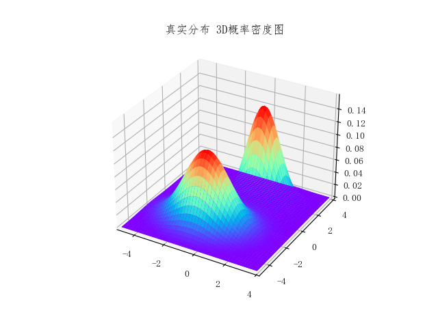
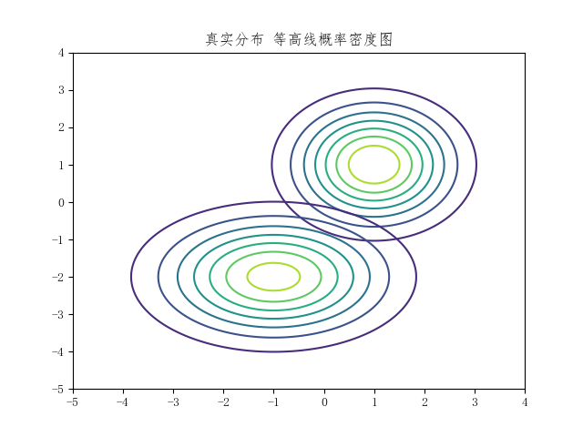
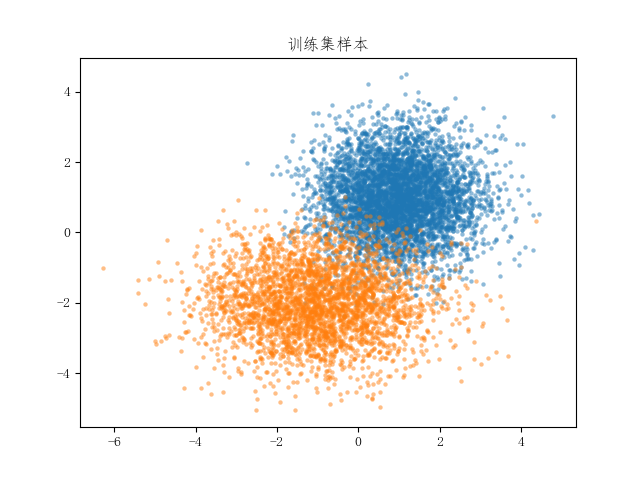
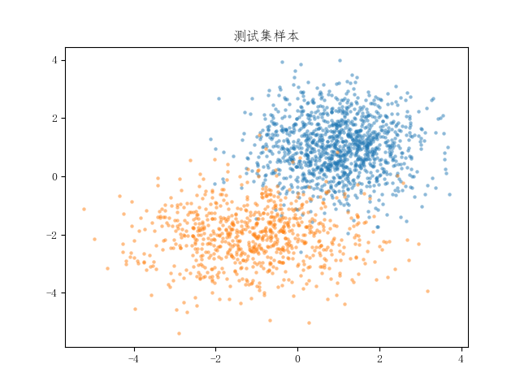
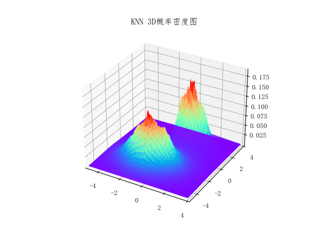
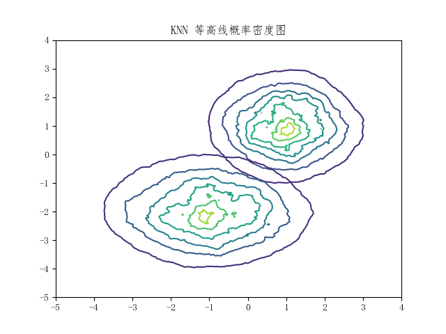
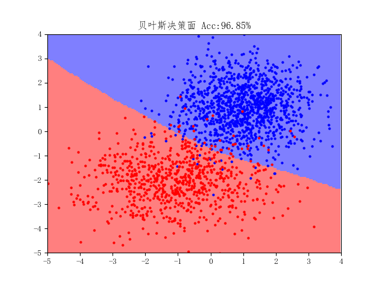

### KNN算法

生成两类样本，其中第1类样本数量为6000，第2类样本数量为4000，以8: 2划分训练集和测试集。

- 第1类样本的分布

  二维正态分布：均值为[1, 1] ，方差为[1, 1]

- 第2类样本的分布

  二维正态分布：均值为[-1, -2]，方差为[2, 1]

在训练集中，统计两种类别的样本数量比，得到先验概率（0.6，0.4），用KNN算法估计出两种类别的概率密度（类条件概率密度）。

已知先验概率和类条件概率，用贝叶斯决策对测试集样本进行分类，画出决策面，计算准确率。

